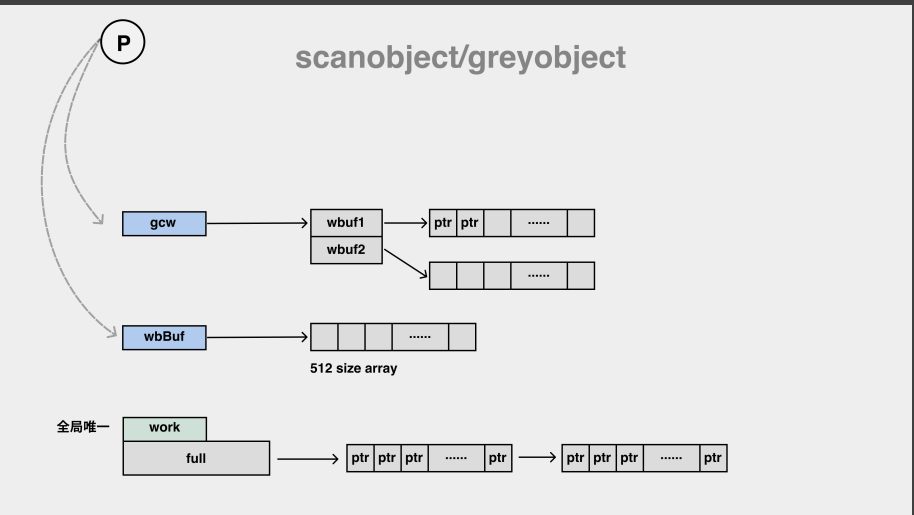

##gc分析以及总结

##面向信仰编程
    标记清除（Mark-Sweep）算法是最常见的垃圾收集算法，标记清除收集器是跟踪式垃圾收集器，
    其执行过程可以分成标记（Mark）和清除（Sweep）两个阶段:
        1.标记阶段 — 从根对象出发查找并标记堆中所有存活的对象；
        2.清除阶段 — 遍历堆中的全部对象，回收未被标记的垃圾对象并将回收的内存加入空闲链表；
    
    多数现代的追踪式垃圾收集器都会实现三色标记算法的变种以缩短STW的时间（Stop the world，STW暂停程序）。
    三色标记算法将程序中的对象分成白色、黑色和灰色三类：
        白色对象 — 潜在的垃圾，其内存可能会被垃圾收集器回收；
        黑色对象 — 活跃的对象，包括不存在任何引用外部指针的对象以及从根对象可达的对象；
        灰色对象 — 活跃的对象，因为存在指向白色对象的外部指针，垃圾收集器会扫描这些对象的子对象；

    三色标记垃圾收集器的工作原理很简单，我们可以将其归纳成以下几个步骤：
        1.从灰色对象的集合中选择一个灰色对象并将其标记成黑色；
        2.将黑色对象指向的所有对象都标记成灰色，保证该对象和被该对象引用的对象都不会被回收；
        3.重复上述两个步骤直到对象图中不存在灰色对象；

 
##Go标记流程
    1.栈上的堆对象是如何处理的。靠heap write barrier
    2.三色抽象，黑、灰、白。
    黑：已经扫描完毕，子节点扫描完毕.(gcmarkbits=1,且在队列外)
    灰：已经扫描完毕，子节点未扫描完毕。(gcmarkbits=1,在队列内)
    白:   未扫描，collector不知道任何相关信息。
    3.弱三色不变性(weak tricolor invariant):⿊⾊对象指向的⽩⾊对象，如果有灰⾊对象到它的可达路径，那也可以
    5.• gcStart -> gcBgMarkWorker && gcRootPrepare，这时 gcBgMarkWorker 在休眠中
	    • schedule -> findRunnableGCWorker 唤醒适宜数量的 gcBgMarkWorker
	    • gcBgMarkWorker -> gcDrain -> scanobject -> greyobject(set mark bit and put to gcw)
	    • 在 gcBgMarkWorker 中调⽤ gcMarkDone 排空各种 wbBuf 后，使⽤分布式 termination
    检查算法，进⼊ gcMarkTermination -> gcSweep 唤醒后台沉睡的 sweepg 和 scvg ->
    sweep -> wake bgsweep && bgscavenge

##垃圾回收器
    标记对象从gcMarkWorker、Mark assist、mitator write/delete heap pointers
    标记对象去哪Work buffer 本地work buffer-> p.gcw  全局work buffer->runtime.work.full
    本地write barrier buffer -> p.wbBuf

    内存通过自动allocator 手工分配
    内存需要自动collector 手工回收
    go的话就是有allocator和collector自动分配与自动回收，这种自动回收的就是垃圾回收技术

##实战营
    垃圾回收入口gcstart:
        runtime.gc、runtime.mallocgc、forcegchelper(如果2分钟内没有去触发gc，后台会自动调用该函数去gc)
        bgSweep也是在main函数启动的时候就初始化了的协程，只不过是休眠的，然后再gcsweep函数清扫的时候被唤醒，就开始进行清扫工作
    标记对象从哪里来:
        gcWork为垃圾回收期提供生产消费任务的抽象，该结构体持有两个工缓冲区wbuf1和wbuf2,他是两个数组，先向wbuf1写数据，当wbf1写满会去切换主备缓冲区，接着向
        wbuf2中写数据，当两个缓冲区都写满，会从全局的工作缓冲区插入或者获取对象。
    标记对象到哪里去:
        获取的时候也是先从本地wbuf1和wbuf2获取，若获取不到去全局work buffer获取，还是没有的化会去write barrier buffer去获取。
    三色抽象:
        黑：已经扫描完毕，子节点扫描完毕.(gcmarkbits=1,且在队列外)
        灰：已经扫描完毕，子节点未扫描完毕。(gcmarkbits=1,在队列内)
        白:   未扫描，collector不知道任何相关信息。
        解决丢失问题:强三色不变性，禁止黑色对象指向白色对象，弱三色不变性，黑色对象指向的白色对象，如果有灰色对象到它的可达路径，那也可以

    大体而言，go的垃圾回收是基于标记清除算法，其实现了三色标记以及内存屏障技术来实现并发的标记清除。
        其主要阶段包括：
        1.标记前的准备工作，包括清理上一次gc留下来的一些object，这是stw的
        2.标记阶段，即对对象进行标记，这是借助于mspan中的sweepgen来确定该对象是否需要gc
        3.标记结束，重新扫描部分根对象，STW
        4.按标记结果进行清扫
    
    go的垃圾回收主要借助了两个技术，一个是三色标记，一个是内存屏障。
        三色标记是指，使用白色，灰色和黑色来对对象进行标记，主要分为以下步骤：
        1.首先将全部的对象标记成白色
        2.将直接联系对象标记成灰色
        3.将灰色对象的直接联系对象变成灰色，而将原来的灰色对象变成黑色
        4.不断重复2，3过程
        剩下的白色对象就是垃圾

##夜读
    垃圾回收策略:标记-清扫(Mark-sweep)、标记-压缩(Mark-compact)、引用计数(reference counting)、复制算法(Semispace copy)
    为什么不选择标记压缩算法，压缩gc能够减少内存碎片，但是go选择tcmalloc这种方式会显著减少了内存碎片，所以压缩算法优势被剥削了，
    为什么不选择分代算法，分代算法需要维护一些其他的链表还有屏障，因为依靠于内存逃逸，使得对象分配在栈上还是堆上这样的机制弥补了分代的优势。

    go选择标记-清扫,并发、增量、准确式三色标记。
    1.8加入了混合写屏障减少了重写扫描将gc减少到微秒级别。1.14抢占式协程调度与基数树内存管理。
    为什么需要STW(标记准备)
    白色对象 — 潜在的垃圾，其内存可能会被垃圾收集器回收；
    黑色对象 — 活跃的对象，包括不存在任何引用外部指针的对象以及从根对象可达的对象；
    灰色对象 — 活跃的对象，因为存在指向白色对象的外部指针，垃圾收集器会扫描这些对象的子对象；

    黑：已经扫描完毕，子节点扫描完毕.(gcmarkbits=1,且在队列外)
    灰：已经扫描完毕，子节点未扫描完毕。(gcmarkbits=1,在队列内)
    白:   未扫描，collector不知道任何相关信息。

    Trace 分析

    混合屏障: 大大缩短了STW时间
        gc开始将栈上的对象全部扫描并标记为黑色,
        gc期间，任何在栈上创建的新对象均为黑色 
        被删除的堆对象标记为灰色
        被添加的堆对象标记为灰色
##首先我们先来了解下什么是垃圾回收。
        golang 的垃圾回收是基于标记清扫算法，这种算法需要进行 STW（stop the world)，这个过程就会导致程序是卡顿的，频繁的 GC 会严重影响程序性能.
        golang 在此基础上进行了改进，通过三色标记清扫法与写屏障来减少 STW 的时间.
        gc的过程一共分为四个阶段：
        1. 栈扫描（开始时STW），所有对象最开始都是白色.
        2. 从 root开始找到所有可达对象（所有可以找到的对象)，标记为灰色，放入待处理队列。
        3. 遍历灰色对象队列，将其引用对象标记为灰色放入待处理队列，自身标记为黑色。
        4. 清除（并发） 循环步骤3直到灰色队列为空为止，此时所有引用对象都被标记为黑色，所有不可达的对象依然为白色，白色的就是需要进行回收的对象。
           三色标记法相对于普通标记清扫，减少了 STW 时间. 这主要得益于标记过程是 "on-the-fly" 的，在标记过程中是不需要 STW 的，它与程序是并发执行的，这就大大缩短了STW的时间.
        Golang gc 优化的核心就是尽量使得 STW(Stop The World) 的时间越来越短。
        详细的Golang的GC介绍可以参看[Golang垃圾回收](https://github.com/KeKe-Li/For-learning-Go-Tutorial/blob/master/src/spec/02.0.md).
        写屏障:
        当标记和程序是并发执行的，这就会造成一个问题. 在标记过程中，有新的引用产生，可能会导致误清扫.
        清扫开始前，标记为黑色的对象引用了一个新申请的对象，它肯定是白色的，而黑色对象不会被再次扫描，那么这个白色对象无法被扫描变成灰色、黑色，它就会最终被清扫，而实际它不应该被清扫.
        这就需要用到屏障技术，golang采用了写屏障，其作用就是为了避免这类误清扫问题. 写屏障即在内存写操作前，维护一个约束，从而确保清扫开始前，黑色的对象不能引用白色对象.
        11. #### GC的触发条件
        Go中对 GC 的触发时机存在两种形式：
        * 主动触发(手动触发)，通过调用`runtime.GC` 来触发`GC`，此调用阻塞式地等待当前`GC`运行完毕.
        * 被动触发，分为两种方式：
          a. 使用系统监控，当超过两分钟没有产生任何`GC`时，强制触发 `GC`.
          b. 使用步调（Pacing）算法，其核心思想是控制内存增长的比例,当前内存分配达到一定比例则触发.
    
##垃圾回收器
    三色标记:
    白色对象 — 潜在的垃圾，其内存可能会被垃圾收集器回收；
    黑色对象 — 活跃的对象，包括不存在任何引用外部指针的对象以及从根对象可达的对象；
    灰色对象 — 活跃的对象，因为存在指向白色对象的外部指针，垃圾收集器会扫描这些对象的子对象；
    根是灰色, 从灰色对象的集合中选择一个灰色对象并将其标记成黑色；
    将黑色对象指向的所有对象都标记成灰色，保证该对象和被该对象引用的对象都不会被回收；
    重复上述两个步骤直到对象图中不存在灰色对象；之后垃圾收集器可以回收这些白色的垃圾.
    
    想要在并发或者增量的标记算法中保证正确性，我们需要达成以下两种三色不变性（Tri-color invariant）中的任意一种：
    
    强三色不变性 — 黑色对象不会指向白色对象，只会指向灰色对象或者黑色对象；
    弱三色不变性 — 黑色对象指向的白色对象必须包含一条从灰色对象经由多个白色对象的可达路径；
    Go 语言中使用的两种写屏障技术，分别是 Dijkstra 提出的插入写屏障(保证强三色不变性,有存活可能的对象都标记成灰色)和 Yuasa 提出的删除写屏障
    Go 语言运行时的默认配置会在堆内存达到上一次垃圾收集的 2 倍时，触发新一轮的垃圾收集，这个行为可以通过环境变量 GOGC 调整，在默认情况下它的值为 100，即增长 100% 的堆内存才会触发 GC
    因为并发垃圾收集器会与程序一起运行，所以它无法准确的控制堆内存的大小，并发收集器需要在达到目标前触发垃圾收集，这样才能够保证内存大小的可控. 垃圾收集调步算法是跟随 v1.5 一同引入的，该算法的目标是优化堆的增长速度和垃圾收集器的 CPU 利用率，而在 v1.10 版本中又对该算法进行了优化，将原有的目的堆大小拆分成了软硬两个目标
    垃圾收集的根对象一般包括全局变量和栈对象.
    Go 语言在 v1.8 组合 Dijkstra 插入写屏障和 Yuasa 删除写屏障构成了如下所示的混合写屏障，该写屏障会将被覆盖的对象标记成灰色并在当前栈没有扫描时将新对象也标记成灰色, 在垃圾收集的标记阶段，我们还需要将创建的所有新对象都标记成黑色，防止新分配的栈内存和堆内存中的对象被错误地回收
    GO使用使用三色抽象、并发增量回收、混合写屏障、调步算法以及用户程序协助等机制将垃圾收集的暂停时间优化至毫秒级以下
    垃圾收集的多个阶段过程:
    清理终止阶段；
    暂停程序，所有的处理器在这时会进入安全点（Safe point）；
    如果当前垃圾收集循环是强制触发的，我们还需要处理还未被清理的内存管理单元；
    标记阶段；
    将状态切换至 _GCmark、开启写屏障、用户程序协助（Mutator Assiste）并将根对象入队；
    恢复执行程序，标记进程和用于协助的用户程序会开始并发标记内存中的对象，写屏障会将被覆盖的指针和新指针都标记成灰色，而所有新创建的对象(栈+堆)都会被直接标记成黑色；
    开始扫描根对象，包括所有 Goroutine 的栈、全局对象以及不在堆中的运行时数据结构，扫描 Goroutine 栈期间会暂停当前处理器；
    依次处理灰色队列中的对象，将对象标记成黑色并将它们指向的对象标记成灰色；
    使用分布式的终止算法检查剩余的工作，发现标记阶段完成后进入标记终止阶段；
    标记终止阶段；
    暂停程序、将状态切换至 _GCmarktermination 并关闭辅助标记的用户程序；
    清理处理器上的线程缓存;
    清理阶段；
    将状态切换至 _GCoff 开始清理阶段，初始化清理状态并关闭写屏障；
    恢复用户程序，所有新创建的对象会标记成白色；
    后台并发清理所有的内存管理单元，当 Goroutine 申请新的内存管理单元时就会触发清理(惰性清除)；

##总结
    1.gc触发条件:手动调用runtime.gc触发、runtime.mallocgc内存分配达到一定比例时触发、系统监控当超过两分钟没有产生任何GC是强制触发
    2.垃圾回收策略:标记-清扫(Mark-sweep)、标记-压缩(Mark-compact)、引用计数(reference counting)、复制算法(Semispace copy)
    3.go垃圾回收算法使用并发、增量、准确式的三色标记清扫算法原因:
        1.为什么不选择标记压缩算法，压缩gc能够减少内存碎片，但是go选择tcmalloc这种方式会显著减少了内存碎片，所以压缩算法优势被剥削了，
        2.为什么不选择分代算法，分代算法需要维护一些其他的链表还有屏障，因为依靠于内存逃逸，使得对象分配在栈上还是堆上这样的机制弥补了分代的优势。
        3.引用计数算法也有明显的缺点,频繁更新引用计数降低了性能,对象间发生循环引用时引用链中的对象都无法得到释放
        4.go更关注于如何更好让gc与用户代码并发执行，而不是非要减少停顿时间。
    三色算法原理:
        黑:已被回收器扫描完毕的对象，不存在任何引用外部指针的对象以及从根对象可达的对象，gcmarkbits=1且在队列外
        灰:已被回收器扫描完毕，但可能储存在指向白色对象的外部指针，垃圾收集器还会扫描这些子对象，gcmarkbits=1且在队列内
        白:未被回收器访问到的对象，回收开始阶段所有对象均为白色，回收结束后，白色对象均不可达
        主要过程:
          1.初始时所有对象被标记为白色
          2.遍历所有根对象，把根对象标记为灰色
          3.从灰色对象集合中选择一个灰色对象并标记为黑色，同时把他们引用的对象标记为灰色。
          4.持续遍历每一个灰色对象，直到没有黑色对象，剩余白色对象即为垃圾对象
    4.执行过程分为标记和清除两个阶段:
        标记阶段-从根对象触发查找并标记堆中所有存活的对象
            a.标记前准备工作，STW的清理上一次留下来的一些对象
            b.开启混合写屏障，对对象进行标记，借助mspan的sweepgen来确定该对象是否需要gc
            c.标记结束，STW的重写扫描部分根对象
        清除阶段-遍历堆中全部对象，回收未被标记的垃圾对象并将回收的内存加入空闲列表
            a.初始化清理状态并关闭写屏障
            b.恢复用户程序，所有新创建的对象被标记成白色
            c.后台并发清理所有内存管理单元，当goruntine申请新的内存管理单元时就会触发
    5.标记对象从哪里来:
        gcWork为垃圾回收期提供生产消费任务的抽象，该结构体持有两个工缓冲区wbuf1和wbuf2,他是两个数组，先向wbuf1写数据，当wbf1写满会去切换主备缓冲区，接着向
        wbuf2中写数据，当两个缓冲区都写满，会从全局的工作缓冲区插入或者获取对象。
      标记对象到哪里去:
        获取的时候也是先从本地wbuf1和wbuf2获取，若获取不到去全局work buffer获取，还是没有的化会去write barrier buffer去获取。
    6.强三色不变性，禁止黑色对象指向白色对象，弱三色不变性，黑色对象指向的白色对象，如果有灰色对象到它的可达路径，那也可以
    为什么需要STW(标记准备):保证实现的正确性、防止无止境的内存增长等问题，防止对象在标记过程中丢失
    当标记和程序并发执行,标记过程中有新的引用产生可能会导致误清扫，
    清扫开始前，标记为黑色的对象引用了新申请的对象，该对象肯定是白色，因为扫描结束该对象还是白色最终被清扫，而实际它不应该被清扫
    这时候需要加入写屏障，类似于一个钩子维护一个约束，从而确保清扫前黑色的对象不能引用白色对象
    插入屏障:保证强三色不变性，有存活可能的对象都标记为灰色，能防止指针从栈被隐藏进堆，但不能防止栈上黑色对象指向堆上白色对象
            为了防止黑色对象指向白色对象，假设`*slot`可能变成黑色，为了确保`ptr`不会在被赋值到`*slot`前变成白色，
            `shade(ptr)`会将`ptr`标记为灰色，避免某一黑色对象引用白色对象
    删除写屏障:能够保证堆上的弱三色不变性，能防止指针从堆被隐藏进栈，但不能防止堆上黑色对象指向堆上白色对象
            为了防止丢失从灰色对象到白色对象的路径，假设`*slot`可能变成黑色，为了确保`ptr`不会在被赋值到`*slot`前变成白色，
            `shade(*slot)`会将`*slot`标记为灰色，该操作总是创造了一条灰色到灰色或者灰色到白色的路径。避免了弱三色不变性
    混合屏障:大大缩短了STW时间
        1.gc开始将栈上的对象全部扫描并标记为黑色
        2.gc期间任何在栈上创建的新对象均为黑色
        3.被删除和被添加的堆对象标记为灰色
    1.10前后go实现了批量写屏障机制，其将着色的指针统一写入一个缓存，每当缓存满时统一对缓存中的所有`ptr`指针进行着色
    1.5实现了基于三色标记清扫的并发垃圾收集器，1.8加入了混合写屏障减少了重写扫描将gc减少到微秒级别。1.14抢占式协程调度与基数树内存管理。
    GC的CPU控制⽬标是整体 25%

    7.gc优化:
        1.控制内存分配的速度，限制 goroutine 的数量，从而提高赋值器对 CPU 的利用率。
        2.减少并复用内存，例如使用 sync.Pool 来复用需要频繁创建临时对象，例如提前分配足够的内存来降低多余的拷贝。
        3.需要时，增大 GOGC 的值，降低 GC 的运行频率。

参考文档：
-- [面向信仰编程-垃圾收集器](https://draveness.me/golang/docs/part3-runtime/ch07-memory/golang-garbage-collector/)
-- [go 垃圾回收源码分析](https://codeantenna.com/a/rDwquqaeqD)
-- [Golang 大杀器之跟踪剖析 trace](https://segmentfault.com/a/1190000019736288)
-- [垃圾回收的认识](https://golang.design/go-questions/memgc/principal/)

