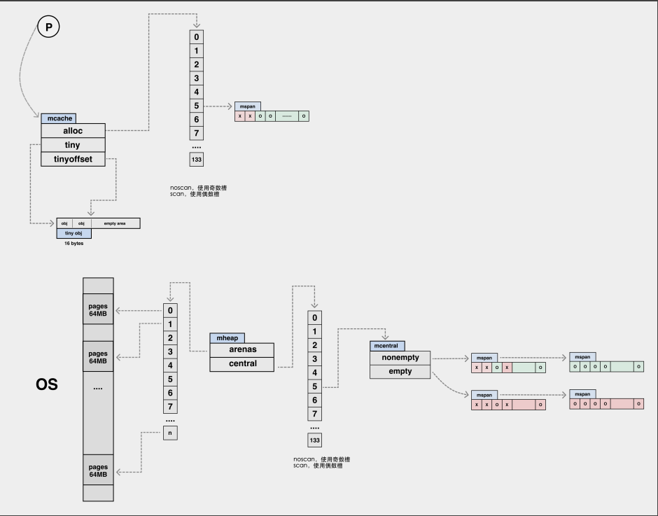

##内存分配分析、逃逸分析以及总结
    线程缓存分配（Thread-Caching Malloc，TCMalloc）是用于分配内存的机制，它比 glibc 中的 malloc 还要快很多2。
    Go 语言的内存分配器就借鉴了 TCMalloc 的设计实现高速的内存分配，它的核心理念是使用多级缓存将对象根据大小分类，并按照类别实施不同的分配策略

    内存分配器不仅会区别对待大小不同的对象，还会将内存分成不同的级别分别管理，TCMalloc 和 Go 运行时分配器都会引入线程缓存（Thread Cache）、
    中心缓存（Central Cache）和页堆（Page Heap）三个组件分级管理内存

    所有的 Go 语言程序都会在启动时初始化如上图所示的内存布局，
    每一个处理器都会分配一个线程缓存 runtime.mcache 用于处理微对象和小对象的分配，它们会持有内存管理单元 runtime.mspan
    每个类型的内存管理单元都会管理特定大小的对象，当内存管理单元中不存在空闲对象时，它们会从 runtime.mheap 持有的 134 个中心缓存 runtime.mcentral 中获取新的内存单元，
    中心缓存属于全局的堆结构体 runtime.mheap，它会从操作系统中申请内存

    mspan是 Go 语言内存管理的基本单元,运行时会使用 runtime.mSpanList 存储双向链表的头结点和尾节点并在线程缓存以及中心缓存中使用
    mcache是 Go 语言中的线程缓存,它会与线程上的处理器一一绑定，主要用来缓存用户程序申请的微小对象。每一个线程缓存都持有 68 * 2 个 runtime.mspan，
           这些内存管理单元都存储在结构体的 alloc 字段中
    mcentral是内存分配器的中心缓存，与线程缓存不同，访问中心缓存中的内存管理单元需要使用互斥锁
    mheap 是内存分配的核心结构体，Go 语言程序会将其作为全局变量存储，而堆上初始化的所有对象都由该结构体统一管理，
          该结构体中包含两组非常重要的字段，其中一个是全局的中心缓存列表 central，另一个是管理堆区内存区域的 arenas 以及相关字段
          mheap跟tcmalloc中的PageHeap相似，负责大内存的分配。当mcentral内存不够时，可以向mheap申请。那mheap没有内存资源呢？跟tcmalloc一样，向OS操作系统申请。
          还有，大于32KB的内存，也是直接向mheap申请

    mcache会通过mcentral的cacheSpan方法获取新的内存管理单元。
        1.调用 runtime.mcentral.partialSwept 从清理过的、包含空闲空间的 runtime.spanSet 结构中查找可以使用的内存管理单元；
        2.调用 runtime.mcentral.partialUnswept 从未被清理过的、有空闲对象的 runtime.spanSet 结构中查找可以使用的内存管理单元；
        3.调用 runtime.mcentral.fullUnswept 获取未被清理的、不包含空闲空间的 runtime.spanSet 中获取内存管理单元并通过 runtime.mspan.sweep 清理它的内存空间；
        4.调用 runtime.mcentral.grow 从堆中申请新的内存管理单元；
        5.更新内存管理单元的 allocCache 等字段帮助快速分配内存；
    首先我们会在中心缓存的空闲集合中查找可用的 runtime.mspan，运行时总是会先从获取清理过的内存管理单元，后检查未清理的内存管理单元
    当找到需要回收的内存单元时，运行时会触发 runtime.mspan.sweep 进行清理，如果在包含空闲空间的集合中没有找到管理单元，那么运行时尝试会从未清理的集合中获取
    如果 runtime.mcentral 通过上述两个阶段都没有找到可用的单元，它会调用 runtime.mcentral.grow 触发扩容从堆中申请新的内存
    无论通过哪种方法获取到了内存单元，该方法的最后都会更新内存单元的 allocBits 和 allocCache 等字段，让运行时在分配内存时能够快速找到空闲的对象。
    
    Go 的内存分配器在分配对象时，根据对象的大小，分成三类：小对象（小于等于 16B）、一般对象（大于 16B，小于等于 32KB）、大对象（大于 32KB）。
    大体上的分配流程：
    1.32KB 的对象，直接从 mheap 上分配；
    2.<=16B 的对象使用 mcache 的 tiny 分配器分配；
    3.(16B,32KB] 的对象，首先计算对象的规格大小，然后使用 mcache 中相应规格大小的 mspan 分配；
    4.如果 mcache 没有相应规格大小的 mspan，则向 mcentral 申请
    5.如果 mcentral 没有相应规格大小的 mspan，则向 mheap 申请
    6.如果 mheap 中也没有合适大小的 mspan，则向操作系统申请

##逃逸分析
    原本变量定义在方法的栈内存中，你看起来这些变量放在栈上，go
    go build -gcflags="-m" 查看为什么会逃逸。
    查看逃逸分析所有可能性，高难度模式可以直接查看cmd/compile/internal/gc/escape.go文件里面的代码，整体看完就能懂了。低难度模式的话https://github.com/golang/go/tree/master/test有一些escape开头的case.
    逃逸分析实现原理，大致算法基于两个不变性：
        a.指向栈对象的指针不能存储在堆中
        b.指向栈对象的指针不能超过该栈对象的存活期。

    逃逸分析实现原理，大致算法基于两个不变性：
    a.指向栈对象的指针不能存储在堆中
    b.指向栈对象的指针不能超过该栈对象的存活期。

    逃逸分析源码解析，Go逃逸分析的输入是Go编译器解析了Go源文件后所获得的整个程序的抽象语法树(Abstract syntax tree,AST)。
    AST的Node切片为xtop，var xtop []*Node，在main函数中，xtop被出入逃逸分析的入口函数escapes。

    escapes大致原理：首先构建一个有向加权图，其中顶点（成为Location，由gc.EscLocation表示）代表由语句和表达式分配的变量，
    而边(gc.EscEdge)代表变量之间的赋值(权重代表寻址/取地址次数)

    接着遍历(visitBottomUp)该有向加权图，在图中寻找可能违反上述两个不变量条件的赋值路径。违反上述不变量的赋值路径。
    如果一个变量v的地址是储存在堆活其他可能会超过他的存活期的地方，那么v就会被标记为需要在堆上分配。

    为了支持函数间的分析，算法还记录了从每个函数的参数到堆的数据流以及到其结果的数据流。算法将这些信息称为"参数标签"。
    这些标签信息在静态调用时使用，以改善对函数参数的逃逸分析

##内存管理器
    Mutator：对象图。fancy(花哨的)word for application,其实就是你写的引用程序它不断的修改对象的引用关系。
    Allocator：内存分配器，负责管理从操作系统中分配出的内存空间，malloc其实底层就有一个内存分配器的实现(glibc中)，tcmalloc是malloc多线程改进版。Go中的实现类似tcmalloc。tcmalloc是需要加锁的。
    Collector：垃圾收集器，负责清理死对象，释放内存空间
    Mutator用户程序申请内存时，他会通过Allocator内存分配器申请新的内存，而分配器会负责从堆中初始化相应的内存区域。

##Allocator基础
    Bump/Sequential Allocator、Free List Allocator 
    Bump Allocator：线性分配器，是一种高效的内存分配方法，但是有较大的局限性。使用线性分配器的时候，我们只需要在内存中维护一个指向特定位置的指针，当用户程序申请内存时，分配器只需要检查剩余的空闲内存、返回分配的内存区域并修改指针在内存中的地址。
    虽然线性分配器有较快的执行速度以及较低的实现复杂度，但是线性分配器无法在内存释放时重用内存。正因为这种特性，我们需要合适的垃圾回收算法配合使用。
    FreeList Allocator：空闲链表分配器，可以重用已经被释放的内存，它的内部会维护一个类似链表的数据结构。当用户程序申请内存时，空闲链表分配器会依次遍历空闲的内存块，找到足够大的内存，然后申请新的资源并修改链表。
    2.Free List Allocator分为First-Fit、Next-Fit、Best-Fit、Segregated-Fit四种匹配算法。
    First-Fit首次适应：从链表头开始遍历，选择第一个大小申请内存的内存块。
    Next-Fit循环首次适应：从上次遍历的结束位置开始遍历，选择第一个大小大于申请内存的内存块
    Best-Fit最优适应：从链表头遍历整个链表，选择最合适的内存块
    Segregated-Fit隔离适应：将内存分割成多个链表，每个链表的内存块大小相同，申请内存是先找到满足条件的链表，再从链表中选择合适的内存块。
    Go使用的是Segregated-Fit的变种,分级匹配，将我们的内存块分成很多不同的级别，比如有8B，16B...8K,可以减少分配产生的内存碎片，

    malloc实现:
    1.执行malloc时，当内存分配小于等于128KB的时候，brk只能通过调整program break(堆顶)位置推动堆增长。当内存大于128KB时候，
      会调用mmap，mmap可以从任意未分配位置映射内存。brk和mmap是一种系统调用。
    2.tcMalloc：线程缓存分配（Thread-Caching Malloc）用于分配内存的机制。它比malloc函数还要快很多^2,
      go语言内置分配器就借鉴了TcMalloc的设计实现高速的内存分配，核心理念是使用多级缓存根据对象根据大小分类，并按照类别实施不用的分配策略。

##Go语言内存分配
    1.go语言内存分配器包含内存管理单元(mspan)、线程缓存、中心缓存和页堆几个重要组件。
     2.内存分配器在go语言中维护了一个多级结构 mspan -> mcache -> mcentral -> mheap
     3.mspan:内存管理单元。
     mcache:与P绑定，本地内存分配操作，不需要加锁。
     mcentral:中心分配缓存，分配时需要上锁，不同spanClass使用不同的锁。
     mheap:全局唯一，从OS申请内存，并修改其内存定义结构时，需要加锁，是一个全局锁。
     4.go语言启动初始化会形成以下内存布局，每一个处理器都会分配一个线程缓存runtime.mcache用于处理微对象和小对象的分配，他们会持有内存管理单元runtime.mspan。
     每个内存管理单元都有管理特定大小的对象，当内存管理单元不存在空闲对象时，他会从中心缓存mcache。
     5.内存分配的整体结构，mspan,mcache,mcentral,mheap。每一个mspan管理特定大小的对象，当用户程序或者线程向mspan申请内存时，该结构会使用allocCache字段对对象为单位在管理的内存中快速查找带分配的空间，当内存中不包含空闲内存时，会去上一级mcache结构添加更多的内存页来进行分配。mcache的alloc包含了67个不含指针的noscan和包含指针的67个scan，mcache中的mspan通过spanClass跨度类展示了从8byte到32k总共66个跨度类大小的内存空间，mcache.refill方法从中心缓存中申请新的mspan到mcache中，当mcache中也没有空闲内存了，会去内存分配器的中心缓存mcentral中申请，访问mcentral的内存管理单元需要使用互斥锁，访问mheap的时候也需要加，mcentral的互斥锁范围比mheap的小，当mcentral的内存也不够时，会使用mcentral.grow从堆中申请新的mspan，mcentral维护了empty和nonempty的链表。如果没central也没有空闲内存了，则会在mheap申请内存，其中需要加互斥锁。Go只会存在一个mheap。堆上初始化的所有对象都由该结构体统一管理。mheap包含两组非常重要的字段，一个全局的中心缓存列表central，另一个管理堆区内存区域的arenas以及相关字段。如果arena区域没有足够的空间，调用mheap.sysAlloc从操作系统中申请跟多的内存。
     6.内存分配：堆上的所有对象通过runtime.newobject函数分配内存。newobject会调用mallocgc分配指定大小的内存空间。使用gomcache获取线程缓存并判断是否为指针类型。mallocgc会根据对象大小执行不通分配逻辑。
     微对象(0,16B): 先使用微型分配器，在依次尝试mcache，mcentral，mheap分配内存。
     小对象(16B,32KB):依次尝试使用mcache，mcentral，mheap分配内存。
     大对象(32KB,+无穷大):直接在堆mheap上分配内存
     7.Refill函数流程，refill方法会为线程获取一个指定跨度的内存管理单元，被替换的单元不能保函空闲的内存空间，而获取的单元需要至少包含一个空闲对象用于分配内存。
       本地mcache没有空闲内存是触发，从mcentral里的non-empty链表中找(mcentral.cacheSpan),当内存等待回收，将其插入empty，尝试sweep清理mcentral的empty，内存正在回收时跳过该内存单元，已经被回收时。将内存单元插入empty链表中。增长扩容mcentral尝试用mcentral.grow函数从arena获取内存,arena如果还是没有，通过mheap.alloc向操作系统申请

##Go标记流程
    1.栈上的堆对象是如何处理的。靠heap write barrier
    2.三色抽象，黑、灰、白。
    黑：已经扫描完毕，子节点扫描完毕.(gcmarkbits=1,且在队列外)
    灰：已经扫描完毕，子节点未扫描完毕。(gcmarkbits=1,在队列内)
    白:   未扫描，collector不知道任何相关信息。
    3.弱三色不变性(weak tricolor invariant):⿊⾊对象指向的⽩⾊对象，如果有灰⾊对象到它的可达路径，那也可以
    5.• gcStart -> gcBgMarkWorker && gcRootPrepare，这时 gcBgMarkWorker 在休眠中
	    • schedule -> findRunnableGCWorker 唤醒适宜数量的 gcBgMarkWorker
	    • gcBgMarkWorker -> gcDrain -> scanobject -> greyobject(set mark bit and put to gcw)
	    • 在 gcBgMarkWorker 中调⽤ gcMarkDone 排空各种 wbBuf 后，使⽤分布式 termination
    检查算法，进⼊ gcMarkTermination -> gcSweep 唤醒后台沉睡的 sweepg 和 scvg ->
    sweep -> wake bgsweep && bgscavenge

##垃圾回收器
    标记对象从gcMarkWorker、Mark assist、mitator write/delete heap pointers
    标记对象去哪Work buffer 本地work buffer-> p.gcw  全局work buffer->runtime.work.full
    本地write barrier buffer -> p.wbBuf

    内存通过自动allocator 手工分配
    内存需要自动collector 手工回收
    go的话就是有allocator和collector自动分配与自动回收，这种自动回收的就是垃圾回收技术

#### Golang的逃逸分析
    所谓逃逸分析（Escape analysis）是指由编译器决定内存分配的位置，不需要程序员指定。 函数中申请一个新的对象如果分配在栈中，则函数执行结束可自动将内存回收；如果分配在堆中，则函数执行结束可交给GC（垃圾回收）处理.
    每当函数中申请新的对象，编译器会跟据该对象是否被函数外部引用来决定是否逃逸：
    1. 如果函数外部没有引用，则优先放到栈中；
    1. 如果函数外部存在引用，则必定放到堆中.
    注意，对于函数外部没有引用的对象，也有可能放到堆中，比如内存过大超过栈的存储能力。
    逃逸分析通常有四种情况:
     * 指针逃逸.
     * 栈空间不足逃逸.
     * 动态类型逃逸.
     * 闭包引用对象逃逸.
#### 逃逸总结
    * 栈上分配内存比在堆中分配内存有更高的效率.
    * 栈上分配的内存不需要GC处理.
    * 堆上分配的内存使用完毕会交给GC处理.
    * 逃逸分析目的是决定内分配地址是栈还是堆.
    * 逃逸分析在编译阶段完成.

##总结
    1.Go内存分配器借鉴了TCMalloc设计实现高速内存分配，核心理念是使用多级缓存将对象根据大小分类，并按照类别实施不同的分配策略
    分配器使用的是空闲列表分配器中的隔离适应策略，将内存分割成多个链表，每个链表内存块相同，申请内存先找到满足条件的链表，
    再从列表中选择合适的内存块。Go使用的事隔离适应策略的变种，分级匹配。将我们内存块分为很多不同层级，比如8B、16B。。。8K，可以减少分配产生的内存碎片。
    2.go内存分配维护了一个多级机构mspan内存管理单元、mcache线程缓存、mcentral中心缓存、mheap页堆
      mspan: 内存管理单元,运行时使用mSpanList存储双向列表的头节点和尾节点，并在mcache和mcentral中使用
      mcache: 与P绑定，本地内存分配操作，不需要加锁，mcache的alloc包含了67个不含指针的noscan和包含指针的67个scan
      mcentral: 中心分配缓存，分配时需要上锁，不同spanClass使用不同的锁。
      mheap: 全局唯一，从OS申请内存，并修改其内存定义结构时，需要加锁，是一个全局锁。
    3.内存分配mallocgc，堆上所有对象通过newobject函数分配，newobject会调用malloc分配制定大小对的内存空间，
      mallocgc会根据对象大小执行不同分配逻辑，大对象直接在堆heap上分配
    4.每一个mspan管理特定大小的对象，当用户程序或者线程向mspan申请内存时，
      该结构会使用allocCache字段为对象在管理的内存中快速查找待分配的空间，
      当内存中不包含内存空间，会去上一级mcache结构添加更多的内存页来分配，mcache的alloc中包含67个不含指针和包含指针的67个scan
      当mcache中也没有内存空间，会去mcentral中申请，访问mcentral内存管理单元需要加上互斥锁，不同spanClass使用不同的锁。
      当mcentral内存也不够时，会通关mcentral.grow从堆中申请新的mspan，mcentral维护了empry和noempty的链表，
      当mcentral内存也不够了，则会加上互斥锁去mheap申请内存。Go中只会存在一个mheap，堆上初始化所有对象都由mheap统一管理。
      mheap包含两组非常重要的字段，一个全局中心缓存列表mcentral，一个是管理堆区内存区域arenas以及相关字段。
      当arenaa区域没有足够的空间，会调用mheap.sysAlloc从操作系统中申请更多的内存
    5.Refill函数流程，refill方法会为线程获取一个指定跨度的内存管理单元，被替换的单元不能保函空闲的内存空间，而获取的单元需要至少包含一个空闲对象用于分配内存。
      本地mcache没有空闲内存是触发，从mcentral里的non-empty链表中找(mcentral.cacheSpan),当内存等待回收，将其插入empty，尝试sweep清理mcentral的empty，
      内存正在回收时跳过该内存单元，已经被回收时。将内存单元插入empty链表中。增长扩容mcentral尝试用mcentral.grow函数从arena获取内存,arena如果还是没有，
      通过mheap.alloc向操作系统申请
    6.mheap 中超过 128 个页的内存会在 freeLarge 中分配，freeLarge 是一个 treap 结构

##逃逸分析总结
    可以使用命令go build -gcflags="-m" 查看为什么会逃逸
    逃逸分析实现原理，大致算法基于两个不变性:
       a.指向栈对象的指针不能存储在堆上
       b.指向栈对象的指针不能超过该对象的存活期。
    逃逸分析源码解析，Go编译器解析了Go源文件后获得整个程序的抽象语法树AST，AST的切片xtop在main函数中被escapes函数调用。
    escapes大致原理首先创建一个有向加权图，其中定点代表由语句和表达式分配的变量，而边代表变量之间的赋值，
           接着遍历该有向加权图，在途中找出可能违反逃逸分析算法两个不变性的赋值路径，
           如果一个变量v的地址是储存在堆或其他可能会超过他的存活期的地方，那么v就会被标记为需要在堆上分配。

参考文档：
-- [面向信仰编程-内存分配器](https://draveness.me/golang/docs/part3-runtime/ch07-memory/golang-memory-allocator/)
-- [字节跳动 Go 语言面试高频题 01：内存分配](https://zhuanlan.zhihu.com/p/352133292)
-- [通过实例理解Go逃逸分析](https://tonybai.com/2021/05/24/understand-go-escape-analysis-by-example/)

